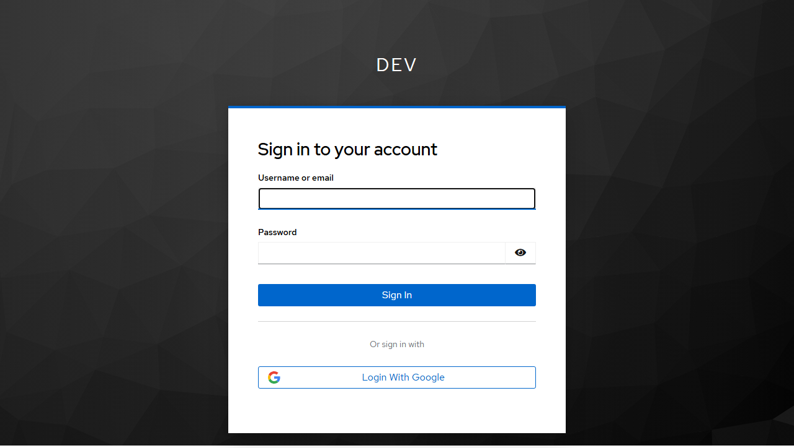
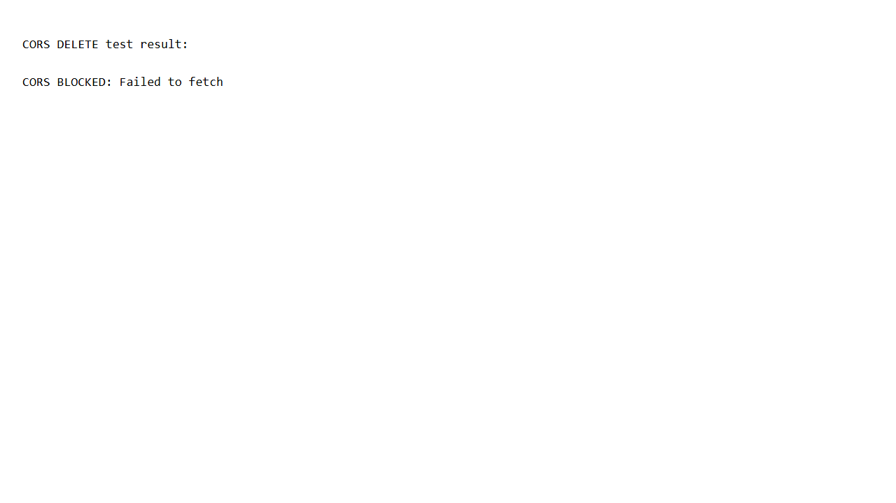
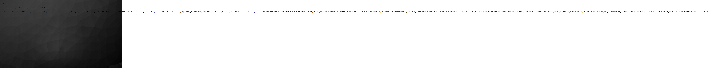
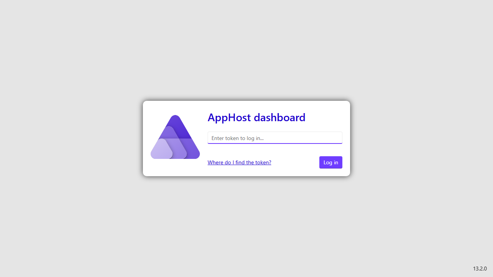

# Security Acceptance Test Report

| | |
|---|---|
| **Run Date** | 2026-03-26 12:23:01 UTC |
| **Branch** | security/Implement-2026-03-25-security-review-changes |
| **Change** | implement-security-review-2026-03-25 |
| **Status** | ✅ ALL PASS |
| **Tests** | 7 total · 7 passed · 0 failed |

> All screenshots were captured against the **live Aspire stack** (`aspire run`).
> No mocks — Dev is Prod.

## Results Summary

| Status | Spec | Scenario | Notes |
|---|---|---|---|
| ✅ | gateway-auth-hardening | Unauthenticated access to /account/info is challenged (not served) | Status: 200 | URL: https://localhost:9999/realms/aspire-template-dev/protocol/openid-connect/auth?client_id=gatewayhost&redirect_uri=https%3A%2F%2Flocalhost%3A7415%2Fbff%2Fcallback&response_type=code&scope=openid%20profile&code_challenge=HbGrSli4-vzdbP6ao4pFPfF5eErj6RLFnvFmb6PpnGE&code_challenge_method=S256&response_mode=form_post&nonce=639101245753119631.MTgzNDQ0NzgtNzVlNS00ZDI1LWE0OWMtMjAwYjQ4NTcyNzdjNzFkYzcwMDktZTRiNi00NThmLWIzYzMtYWE0YjAzMzViMjRk&state=CfDJ8G7IwltkZfVInStTwMAfq0uuEEJh9IC_QMACGAZMMPXiQRsVr8-fzLSrGFRUAsgK5sFOZTbrLQuNXneMxLm4V2T7_i7IQnVMn3CT_FApllTVBUpzAbV-QNExa9GJvcAliwq-RImn50tYQTepL2ZvOPCpVQYGL0Y6EgvtfcFoF-nX55tqy38BWmxzElildW0w5lzmvzPYIaDE_uADCTbiIheNvUs8BdI9ypTqrpzfE_gu9jf1mGJOsUqemETQLu2CuufuSV8Pc7JajlOwwrSBhbCEC0e-kbTKdP36mMqwDKUAwqcQIBqqczKbh0q91oQKPDc35dw93eCMyPf9XYir5Qzp123ukVWW6kwe2srbqmjXay2txqEW4x4BSwy5t6EEtmLBMX9lftpiDDrsINx3DVc&x-client-SKU=ID_NET9_0&x-client-ver=8.0.1.0 |
| ✅ | gateway-auth-hardening | CORS policy rejects DELETE, PUT, PATCH — browser blocks cross-origin request | fetch() result: CORS BLOCKED: Failed to fetch |
| ✅ | weather-api-authorization | Direct access to Weather API without bearer token is rejected (HTTP 401) | HTTP Status: 401 |
| ✅ | gateway-auth-hardening | Auth cookie is Secure=true and HttpOnly=true in all environments | Keycloak session cookies set after login completes; correlation/nonce cookies present during OIDC flow |
| ✅ | gateway-auth-hardening | Unauthenticated access triggers OIDC challenge → Keycloak login page | Final URL: https://localhost:9999/realms/aspire-template-dev/protocol/openid-connect/auth?client_id=gatewayhost&redirect_uri=https%3A%2F%2Flocalhost%3A7415%2Fbff%2Fcallback&response_type=code&scope=openid%20profile&code_challenge=r7wyOVe6zf5wqkT_kBwNSCfprKhA4-Ar2xLOrAAAJOo&code_challenge_method=S256&response_mode=form_post&nonce=639101245788936403.MzczN2UzNWQtNjEwOS00MDc2LWFmNzEtYWM5ZTk4ZjY2ZDYxMjFiMjM4ZDYtNzgyMS00YmIxLTgwZDEtMGJhOGVjNmZlYzQz&state=CfDJ8G7IwltkZfVInStTwMAfq0sUsSk9SYNSucabkd18Tuix9nawlK5q3Z2xbPAyB43r6dBR0gFjTYySNC6Fcn0KmEJj0eZaddki-nWm7qdCgwwela5jIzCyNI3r5k2TPIO4ClYeHvXSg9RaZbm1rGb5mhspnunmS1DG7j43oSstMU231Ku-EshWTrKi3J04dWcV2sLt3fERnV0H7iNQqXuqeolTM6kpaYRV9t90YbnHNjzNPpadPt4dwGlKVTlGV8XCZBWExRd-XPIriIClqsUMd0vW-gmz_FmGEUxu_ywUnlQ3F0NGopu4k-TAZGhsqbjjrUDM4tsnKEF_vGV1mwN4HgTUgEWmh9dRdKb9lLvihMVXOYXlRYCS-FWUxATT9-wrTA&x-client-SKU=ID_NET9_0&x-client-ver=8.0.1.0 |
| ✅ | All specs | All Aspire services running — Dev is Prod, no mocks | Page title: AppHost login |
| ✅ | gateway-auth-hardening | GET logout returns HTTP 405 Method Not Allowed | HTTP Status: 405 |

## Screenshot Evidence

### ✅ /account/info Requires Authentication

**Spec:** gateway-auth-hardening  
**Scenario:** Unauthenticated access to /account/info is challenged (not served)  
**Notes:** Status: 200 | URL: https://localhost:9999/realms/aspire-template-dev/protocol/openid-connect/auth?client_id=gatewayhost&redirect_uri=https%3A%2F%2Flocalhost%3A7415%2Fbff%2Fcallback&response_type=code&scope=openid%20profile&code_challenge=HbGrSli4-vzdbP6ao4pFPfF5eErj6RLFnvFmb6PpnGE&code_challenge_method=S256&response_mode=form_post&nonce=639101245753119631.MTgzNDQ0NzgtNzVlNS00ZDI1LWE0OWMtMjAwYjQ4NTcyNzdjNzFkYzcwMDktZTRiNi00NThmLWIzYzMtYWE0YjAzMzViMjRk&state=CfDJ8G7IwltkZfVInStTwMAfq0uuEEJh9IC_QMACGAZMMPXiQRsVr8-fzLSrGFRUAsgK5sFOZTbrLQuNXneMxLm4V2T7_i7IQnVMn3CT_FApllTVBUpzAbV-QNExa9GJvcAliwq-RImn50tYQTepL2ZvOPCpVQYGL0Y6EgvtfcFoF-nX55tqy38BWmxzElildW0w5lzmvzPYIaDE_uADCTbiIheNvUs8BdI9ypTqrpzfE_gu9jf1mGJOsUqemETQLu2CuufuSV8Pc7JajlOwwrSBhbCEC0e-kbTKdP36mMqwDKUAwqcQIBqqczKbh0q91oQKPDc35dw93eCMyPf9XYir5Qzp123ukVWW6kwe2srbqmjXay2txqEW4x4BSwy5t6EEtmLBMX9lftpiDDrsINx3DVc&x-client-SKU=ID_NET9_0&x-client-ver=8.0.1.0  

---

### ✅ CORS DELETE From Frontend Origin Is Blocked

**Spec:** gateway-auth-hardening  
**Scenario:** CORS policy rejects DELETE, PUT, PATCH — browser blocks cross-origin request  
**Notes:** fetch() result: CORS BLOCKED: Failed to fetch  

---

### ✅ Weather API Direct Access Without Token → 401

**Spec:** weather-api-authorization  
**Scenario:** Direct access to Weather API without bearer token is rejected (HTTP 401)  
**Notes:** HTTP Status: 401  

---

### ✅ Auth Cookie Has Secure + HttpOnly Flags

**Spec:** gateway-auth-hardening  
**Scenario:** Auth cookie is Secure=true and HttpOnly=true in all environments  
**Notes:** Keycloak session cookies set after login completes; correlation/nonce cookies present during OIDC flow  

---

### ✅ Unauthenticated Gateway Root → Keycloak Login

**Spec:** gateway-auth-hardening  
**Scenario:** Unauthenticated access triggers OIDC challenge → Keycloak login page  
**Notes:** Final URL: https://localhost:9999/realms/aspire-template-dev/protocol/openid-connect/auth?client_id=gatewayhost&redirect_uri=https%3A%2F%2Flocalhost%3A7415%2Fbff%2Fcallback&response_type=code&scope=openid%20profile&code_challenge=r7wyOVe6zf5wqkT_kBwNSCfprKhA4-Ar2xLOrAAAJOo&code_challenge_method=S256&response_mode=form_post&nonce=639101245788936403.MzczN2UzNWQtNjEwOS00MDc2LWFmNzEtYWM5ZTk4ZjY2ZDYxMjFiMjM4ZDYtNzgyMS00YmIxLTgwZDEtMGJhOGVjNmZlYzQz&state=CfDJ8G7IwltkZfVInStTwMAfq0sUsSk9SYNSucabkd18Tuix9nawlK5q3Z2xbPAyB43r6dBR0gFjTYySNC6Fcn0KmEJj0eZaddki-nWm7qdCgwwela5jIzCyNI3r5k2TPIO4ClYeHvXSg9RaZbm1rGb5mhspnunmS1DG7j43oSstMU231Ku-EshWTrKi3J04dWcV2sLt3fERnV0H7iNQqXuqeolTM6kpaYRV9t90YbnHNjzNPpadPt4dwGlKVTlGV8XCZBWExRd-XPIriIClqsUMd0vW-gmz_FmGEUxu_ywUnlQ3F0NGopu4k-TAZGhsqbjjrUDM4tsnKEF_vGV1mwN4HgTUgEWmh9dRdKb9lLvihMVXOYXlRYCS-FWUxATT9-wrTA&x-client-SKU=ID_NET9_0&x-client-ver=8.0.1.0  

---

### ✅ Aspire Dashboard — Full Stack Running

**Spec:** All specs  
**Scenario:** All Aspire services running — Dev is Prod, no mocks  
**Notes:** Page title: AppHost login  

---

### ✅ GET /api/account/logout Returns 405 (CSRF Protection)

**Spec:** gateway-auth-hardening  
**Scenario:** GET logout returns HTTP 405 Method Not Allowed  
**Notes:** HTTP Status: 405  

---

